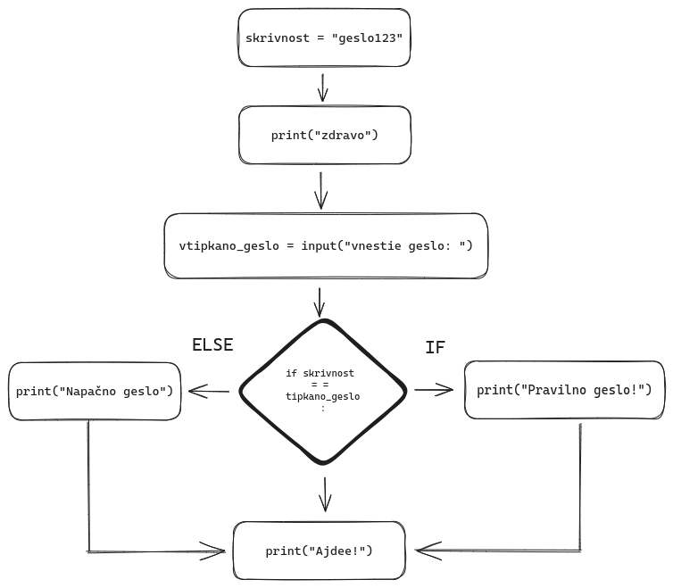

Do sedaj se je vsa koda, ki smo jo spoznalni tekla **naravnost**. Poglejmo si primer:  

```py
print("ena")
print("dve")
print("tri")
```

Programi, ki smo jih pisali so se vedno zvajali od vrha proti dnu, kjer so se vedno izvedle `vse` vrstice.  
Ta program izpiše, po vrsti, `ena`,`dve`,`tri`. Tej vrsti izvajanja operacij pravimo `kontrolni tok`. Pove nam kakšen je vrstni red izvajanja operacij v programu.  


Poglejmo si kako uporavljati z zaporedjem ukazov s pomočjo pogojnih skokov.  

## If pogojni stavek

```py
if pogoj :
  # Koda, ki se izvede, če je pogoj izpolnjen. Taki kodi rečemo telo pogojnega stavka

```

Pogojni stavek if izvede kodo, če je izpolnjen določen pogoj. Pogoj je logična izjava, ki se izrazi z uporabo operatorjev za primerjavo in smo jih že spoznali v prejšnjih poglavjih.

S pomočjo `if` stavkov lahko izvedemo del programa, če je neka trditev resnična.  
Recimo, da si želimo perveriti geslo, ter uporabnika pozdravimo če napiše pravilno geslo.  

```py
# nastavimo skrito geslo
skrivnost = "geslo123"
# pozdravimo uporabnika
print("zdravo")
# uporabnika prosimo za vhod
vtipkano_geslo = input("vnestie geslo: ")

# preverimo če je geslo pravilno
if skrivnost == tipkano_geslo:
  print("Dobrodošli")

# pozdravimo ko gre
print("Ajdee!")
```

Graf izvajanja programa bi izgledal tako:  


Pozravljanje in odzrdravljanje se bo zgodilo vedno oz `brezpogojno`, tako kot to poznamo od prej.  
Stavek "Dobrodošli" se bo izpisal le, če je vrednost v stavku pravilna.  
Kodo razumemo kot "izvedi `print('Dobrodošli')` **če** je skrivnost enaka vtipkanemu_geslu."  

> Koda znotraj okvirja `if stavka` je zamaknjena. (ang. `indented` ).  
> Pravimo, da so ti ukazi v istem `scope`-u.

V našem primeru se bo vsa koda znatraj tega scopa `if` stavka izvedla, če bo zahteva `skrivnost == tipkano_geslo` izpolnjena.
Temu pravimo tudi vejitev programa.  
Na zgornji sliki lahko namreč opazimo, da vsak if stavek izgleda kot "veja" nekega programa.  

## Else stavek

Ugotovili smo kako izvršiti del kode če pogoj drži, radi pa izvedli del kode tudi ko pogoj **ne drži**.  

```py
# izvde se vedno
skrivnost = "geslo123"
print("zdravo")
vtipkano_geslo = input("vnestie geslo: ")

# preverimo pogoj
if skrivnost == tipkano_geslo:
  # izvede se če pogoj drži
  print("Pravilno geslo!")in računanju
else:
  # izvede se če pogoj ne drži
  print("Napačno geslo!")

# izvede se vedno 
print("Ajdee!")
```

`Else` stavek vedno deluje v paru z stavkom `if`.  
V primeru zgoraj lahko vidimo kako z if in else stavkoma implementiramo enostavvno prijavo.  



`If` in `else` sta ena izmed najpomembnejših konceptov v programiranju. Skupaj z znjem o [spremenljivkah in računanju](/blog/osnove-pythona/) (iz prejšnjih poglavji) lahko rešimo veliko problemov.

### Naloge

Vhod v naloge berite z pomočjo spodnjega primera:

```py
vhodni_niz = input("vnesi niz: ")
vhodno_stevilo = int(input("vnesi stevilo: ")) # števila preberemo tako, da niz pretvorimo v int - celo število
```

1. Napiši program, ki prebere vhod tipa `int` in izpiše `LIHO` ali `SODO` glede na to ali je število liho ali sodo. Pomagajte si z operatorjem za ostanek pri deljenju `%`.

2. Napiši program, ki sprejme dve števili ter izpiše `PRVO ŠTEVILO JE VEČJE` ali `DRUGO ŠTEVILO JE VEČJE`. Bo program deloval smiselno pri vseh vhodih?

3. Napiši program, ki sprejme ime (tipa niz). Če je ime daljše od 5 znakov izpišite `waw! dolgo ime!`, čene pa izpišite ime, ki je skrajšano na 5 znakov. Pomagjate si z operatorjem za slicing (`"zdravo"[:5]`).

4. Napiši program, ki sprejme 2 vhodni cifri in jih izpiše urejene po vrstnem redu (padajoče).

## Elif

Včasih potrebujemo več kot eno preverjanje, za to lahko stavek else in if kombiniramo v stavku `elif`.  

To je najlažje vidno na **primeru**:

```py
a = 10 # vhod
#--------------

if( a < 0):
  print("a je negativno")
elif (a > 0):
  print("a je pozitivno")
else:
  print("a je 0")
```

Z stavkom `elif` lahko primejamo poljubno mnogo pogojev. Za daljši primer sem prosil `ChatGPT`. Dal mi je primer za program, ki določi letni čas iz podane številke meseca:

```py
month = int(input("enter month: "))

if month == 12 or month == 1 or month == 2:
        season = "Winter"
    elif month >= 3 and month <= 5:
        season = "Spring"
    elif month >= 6 and month <= 8:
        season = "Summer"
    elif month >= 9 and month <= 11:
        season = "Fall"
    else:
        season = "Invalid month"

print(season)
```

### Naloge

1. Napišite program ki sprejme tri števila, stranice trikotnika, ter izpiše kakšnega tipa je trikotnik. Če ima vse stranice enako dolge, izpišite `enakostratični`, če ima dve isti `enakokraki`, če pa so vse različne izpišite `navaden dolgočasen trikotnik`. Namig: uporabiti bo treba `and` in `or` za primerjavo večih pogojev.

2. Napišite program, ki sprejme oceno od 1 do 5 ter izpiše opisno oceno (nezadostno, zadostno...). Najprej preverite če je vhod pravilen (je med 1 in 5). Če ni, izpišite napako, kregajte uporabnika in izklopite program. Za to lahko uporabite `exit(1)`.

## Gnezdeni (nested) pogoji

V telesu if stavka se lahko nahja karkoli, tudi novi if stavki. To nam omogoča neskončno kompleksne verige primerjave, ki izgledajo tako.  

```py
i = 36

if i % 6 == 0:
  print(f"{i} je deljiv s 6")
  if i % 3 == 0:
    print(f"{i} je deljiv tudi s 3")
  else:
    print(f"{i} ni deljiv s 6")
else:
  print(f"{i} ni deljiv s 6")
```

V praksu se za razliko od `elif` gnezdeni if stavki pojavljajo veliko bolj pogosto. Lahko tudi zamenjajo elif kot v naslednjem primeru:  

```py
a = 10 # vhod
#--------------

if a == 0:
  print("a je 0")
else:
  if a < 0:
    print("a je negativno")
  elif a > 0:
    print("a je pozitivno")
```

## Ternery operator (enovrstični if stavek)

Kot leni programerji nam je seveda težko napisati vsako vrstico...  
Python (in mnogi drugi jeziki) za to omogočajo enovrstične if stavke. To imenujemo `ternery operator` in izgleda tako:  

```py
i = 8

vrednost = "liho" if 8%2==0 else "sodo"
```

Za začetek predlagava, da se tega zapisa izogibate in pišete pogojne stavke v klasični obliki, potrebno pa je poznati to sintakso ker je pogosto uporabljena na forumih in spletnih straneh.

> `Sintaksa` opisuje izgled / sestavo programskega jezika.


### Naloge

Napišite program, ki v eni vrstici preveri ali je število negativno, pozitivno ali 0.

Začnite s programom, ki najprej preveri le pozitivost in negativnost ter ga dogradite do programa, ki izpiše tudi ničelno vrednost.  
