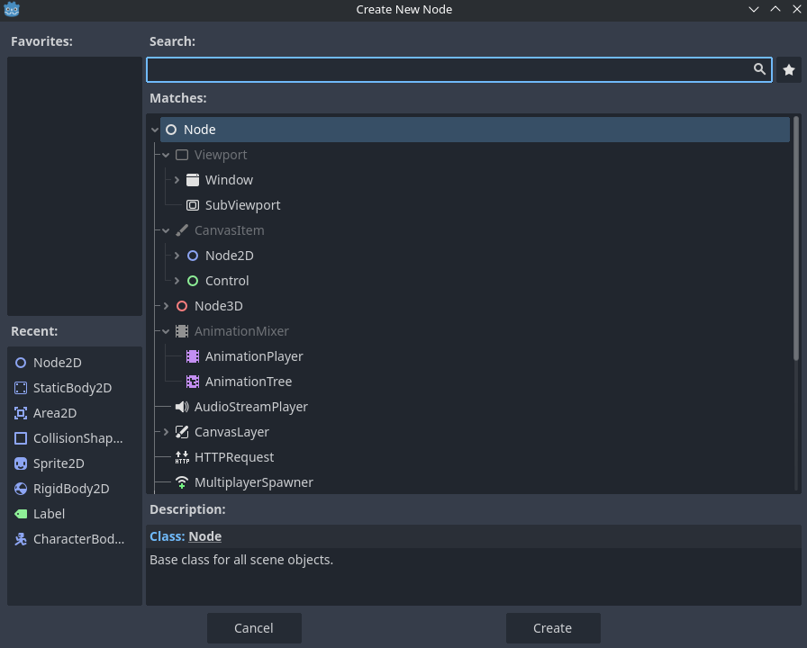
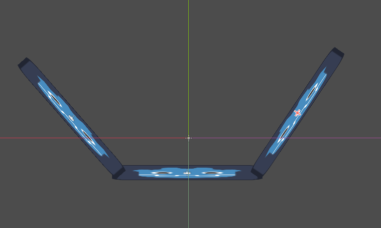
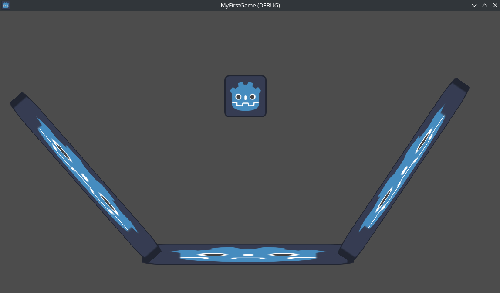
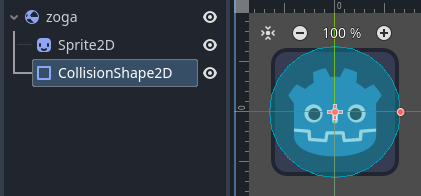
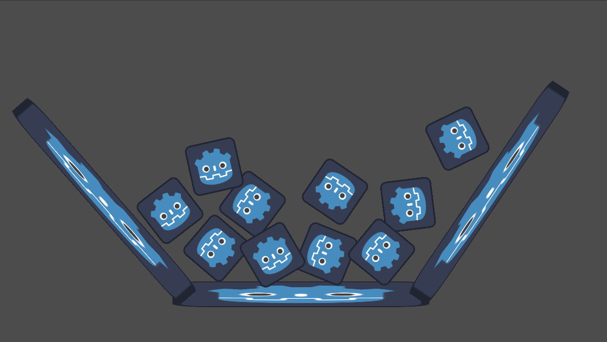

V prvem poglavju smo se na hitro spoznali z Godotom in opisali njegove sestavne dele - bolj teorija.
V tem poglavju pa bomo že začeli s praktično uporabo.

# Node

Node je osnovni gradnik vsake videoigre. Vsak node izvaja določeno funkcijo in ima določene lastnosti. Obstaja veliko različnih vrst nodov, vsak je prilagojen za določeno funkcijo. Najenostavnejši vsebujejo samo podatke o položaju, rotaciji in velikosti. Bolj napredni pa jih nadgrajuejo in tako omogočajo različne funkcionalnosti.
Tekom krožka bomo naredili tudi svoje node, ki bodod izvajale funkcije, ki jih bomo potrebovali.
Za začetek pa bomo uporabili že vgrajene node. Godot ima veliko že narejenih nodov, ki nam močno olajšajo delo.

Pa začnimo. V `tree view`-u (leva stran Godot Editorja) kliknemo na `2D scene`. V našo igro smo tako dodali node tipa `Node2D`. To je osnovni node za 2D igre. Ko imamo ta node označen, lahko v `inspektorju` (desna stran Godot Editorja) vidimo vse njegove lastnosti. Za nas bodo sedaj najbolj pomembne lastnosti pod zavihkom `Transform`. Tu lahko spreminjamo položaj, rotacijo in velikost noda.
Malce se poigraj s temi lastnostmi. Spremeni `x` in `y` vrednosti ter opazuj, kako se node premika po ekranu. Z miško premakni node v sredinjskem oknu in opazuj, kako se spremenijo vrednosti v `inspektorju`. Nato poenostavi vse vrednosti nazaj na privzete vrednosti s klikom na zavito belo puščico.

Node2D je sam po sebi malce dolgočasen. Če želimo na njegovem mestu prikazati sliko, moramo to funkcionalnost dodati sami. Godot ima že vgrajen node, ki to omogoča - kliče se `Sprite2D`. Z desnim klikom na Node2D odpremo meni in izberemo `Add child node`. Odpre se nam sledeče okno z vsemi možnimi nodi, ki jih lahko dodamo kot otroke:

Vidimo, da obstaja poseben node `Node`, vsi preostali pa so nekako pod njim (njegovi otroci). Vsak node ima vse lastnosti svojega starša + nekaj novih. Z iskalnikom poiščemo `Sprite2D`. Vidimo, da je `Sprite2D` otrok `Node2D`, ta je otrok `CanvasItem`-a, ta pa je otrok `Node`-a. S klikom `Create` ga dodamo v našo sceno. V inspektorju vidimo, da ima poleg lastnosti, ki jih je imel `Node2D`, še dodatno lastnost pod `Sprite2D`. Kliknimo na `<empty>`, `Quick load` in izberemo edino možnost. Vidimo, da smo v našo igro dodali sliko.

Ker bomo iz tega v nadljevanju naredili zid, dajmo to sliko malo raztegniti. V `transform` spremenimo scale vrednost `x` na recimo `5`. Spremenila se je tudi vrednost `y`, saj sta `x` in `y` povezana. To izklopi s klikom na verižni člen in nato nastavi `y` na `0.5`. S tem smo naredili "zid", ki je 10x večji po širini kot po višini.
Za konec še preimenujemo node. Dvakrat kliknemo na Node2D v tree viewu in vpišemo `Zid`.

# Scene

Skupek nodov lahko `zapakiramo` v sceno. To sceno lahko potem večkrat uporabimo. Na vrhu sredinskega okna trenutno vidimo `[unsaved](*)`. Na tipkovnici kliknemo `ctrl+s` (drži kontrol in klikni s) in shranimo sceno pod imenom `zid.tscn`. Vidimo, da se je `[unsaved](*)` spremenil v `zid`. Desno od napisa je `X`, ki nam sceno zapre, še bolj desno pa `+`, ki nam odpre novo sceno.

Odprimo novo sceno, v njo dodamo `Node2D`, ga preimenujemo v `root` ter shranimo pod imenom `main.tscn`. V to sceno bomo sedaj dodali nekaj zidov. To lahko storimo na več načinov. Najlažje je, da spodaj levo v podatkovnem sistemu izberemo `zid.tscn` in ga povlečemo v sredinsko okno. Tako smo dodali zid v našo sceno. Dodaj 3 zidove in jih postavi tako, da tvorijo nekakšno skledo. Za to uporabi lastnosti nodov, kot so `position` in `rotation`. Spoznaj se tudi z nekaterimi orodji na vrhu sredinskega okna, kot so `Move Mode`, `Rotate Mode` in `Scale Mode`. S temi orodji lahko premikaš, rotiraš in spreminjaš velikost nodov.

Sedaj imamo glavno sceno naše zelo primitivne igre. Temu sicer še niti ne moramo reči igra, ampak počasi, bomo že prišli do tega.

## Žoga

Sedaj bomo naredili "žogo", ki se bo kotalila po tej skledi.
Ponovno naredimo novo sceno, dodamo `Node2D`, ga preimenujemo v `zoga`. Kot smo to že naredili, dodamo `Sprite2D` in izberemo isto sliko kot prej (vem, ne zgleda ravno kot žoga, predstaavljaj si, da je). Sceno nato shranimo pod imenom `zoga.tscn`.

Premaknimo se nazaj v `main`sceno in, tako kot smo prej dodali zidove v to sceno, dodajmo še žogo. Sedaj pa trenutek resnice. Zgoraj desno kliknemo `Run current scene` in... hmm to pa ni bilo po naših pričakovanjih. Res je, da se je odprlo okno z našo "igro", vendar sploh ne vidimo vsega dogajanja.

Zaprimo okno in se vrnimo v Godot Editor. Če dobro pogledamo lahko v sredinskem oknu vidimo modr pravokotnik. V tem pravokotniku je vse, kar se bo prikazalo v naši igri. Ker želimo, da se v oknu vidi cela skleda. Zato moramo v sceno dodati novo kamero. Na levi strani dodamo novega otroka nodeu z imenom `root` in sicer `Camera2D`. Pokaže se nam vijola kvadrat. Z lastnostmi v inspektorju kamero popravimo tako, da bo videla celotno skledo.

Ponovno kliknemo `Run current scene` in... okej, bolje, vsaj vidimo celotno skledo. Vendar nič se ne premika. Le zakaj?

## Funkcionalnosti nodov

Vsak node izvaja samo določeno funkcionalnost. Trenutno uporabljamo samo `Node2D` in `Sprite2D`. Ta dva tipa nodov sta odgovorna samo za izgled in pozicijo naših objektov. Če želimo, da se naša žoga premika, moramo uporabiti node, ki ima takšno funkcionalnost. Na srečo ima Godot že vgrajen node, ki to omogoča.

Premaknimo se v sceno `zoga`. Z desnim klikom na `zoga` izberemo `Change type` in izberemo `RigidBody2D`. Tako smo spremenili tip nodea in mu s tem dodali nove funkcionalnosti. Opazimo, da smo dobili tudi neko opozorilo, vendar ga zaenkrat ignorirajmo. Shranimo sceno in se vrnimo nazaj v `main`. Ponovno kliknemo `Run current scene` in... žoga se premika, woohoo... ampak,... zakaj gre kar skozi skledo?

Imamo isti problem kot prej. Noben node ne preverja trkov med objekti. 
Ponovno moramo dodati nov node, ki bo naši žogici in zidovom dodal to funkcionalnost. Vrnimo se v sceno `zoga` in dodamo novega otroka tipa `CollisionShape2D`. V inspektorju izberemo `<empty>` in nato `New CircleShape2D`. Kliknemo na `Circle` in mu povečamo radius, tako da bo lepo sovpadal z sliko naše žoge. Zgledati mora nekako takole:

Shranimo spremembe in nato odpremo sceno `zid`. Tudi tu dodamo nov node tipa `CollisionShape2D`. Izberemo `RectangleShape2D` in ga prilagodimo tako, da bo sovpadal z zidom. Dobimo še eno opozorilo, ki pravi, da moramo spremeniti tip nodea `zid`. Spremenimo ga v `StaticBody2D`.

Sedaj pa končno! Shranimo sceno in se vrnimo v `main`. Ponovno kliknemo `Run current scene` in... žoga se zabije v zid. Woohoo!

## Več žogic!

Pojdimo nazaj v sceno `zoga`, kliknimo na node `zoga`. V inspektorju pod RigidBody2D vidimo lastnost `Physics Material Override`. Ustvarimo nov material in mu povečamo `Bounce`. Ponovno shranimo, spremenimo na `main` sceno, poženemo in... žoga se odbija od zidov.

V sceno dodajmo še več žogic, poglej kako se odbivajo med sabo!

# Zaključek

V tem poglavju smo si pogledali, kako kombiniramo različne node, da dobimo željeno funkcionalnost. Skupek nodov lahko zapakiramo v sceno in jo nato uporabimo večkrat.