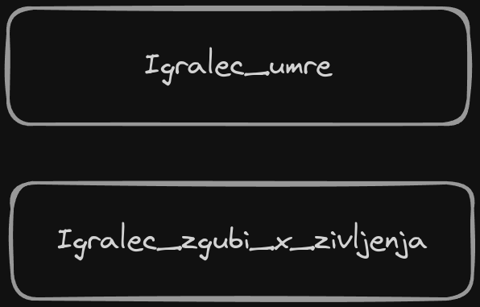
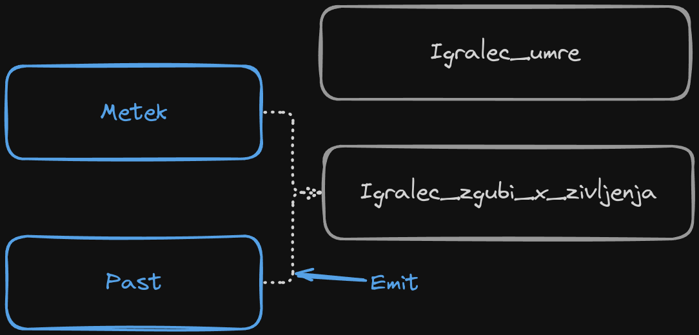
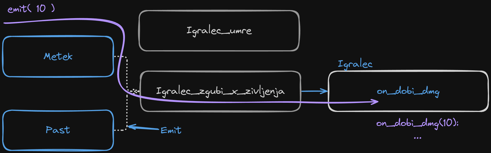

Za odlično razlago signalov si lahko preberete tudi uradno dokumentacijo [Godot signals docs](https://docs.godotengine.org/en/stable/getting_started/step_by_step/signals.html)

Ugotovili smo, da so scene odličen način za pakiranje elementov, ki delujejo skupaj v eno celoto. Problem nastane, ko želimo, da te komponente komunicirajo med sabo.  
Klasični primeri za to so recimo:

- Metek sporoči igralcu, naj si odšteje nekaj točk življenja
- Kovanec je pobran in sporoči igralcu da ima 1 kovanec več
- Nasprotnik umre in sporoči igri, naj se prišteje nekaj točk XPja
- Vrednost se spremeni in sporoči grafičnem umesniku naj izriše posodobljene vrednosti.

Godot za komunikacijo med komponentami uporablja ti. `sporočilni sistem` (ang. [message broker](https://www.ibm.com/think/topics/message-brokers)), ki ga imenuje `signali`.  
Za takšen način komunikaicje obstaja več terminov. Če prihajate iz sveta Javascripta ste mogoče slišali za [Observable](https://rxjs.dev/guide/observable) ali pa za [Pub-Sub](https://redis.io/docs/latest/develop/interact/pubsub/), če ste se ukvarjali z bazami kot je Redis. Operacijski sistem Linux za medprocesno komunikacijo lahko uporablja sistem [Named Pipes](https://www.scaler.com/topics/linux-named-pipe/), ki je zelo podoben signalom.  
Vidimo lahko, da Godot uporablja zelo znan in leta uporabljen sistem, ki se v praksi očitno dobro obnese.

## Delovanje

Sporočilni sistemi kot so signali imajo **tri elemente**:

- **Signal**
  - kanal preko katerega se sporočilo prenaša
  - tudi `room (soba)`, ali `topic (tema)`
- **Prejemnik**
  - Prejema sporočila
  - tudi `subscriber`, `observer`
- **Pošiljatelj**
  - Pošilja sporočila
  - tudi `emitter`, `publisher`

Predstavljamo si lahko, da z signali gradimo **"cevi"** v katere pošiljamo podatke, cevi pa na to povežemo na komponento, ki rabi te podatke.

### Signal

Je osnovni gradnik sistema. Predstavljamo si ga kot **cev**.  
Signal sam po sebi ne dela nič drugega, kot samo definira prenosni kanal.  

Za primer lahko naredimo dva kanala, `igralec_umre` in `igralec_izgubi_x_zivljenja`.  

```gdscript
signal igralec_umre()
signal igralec_izgubi_x_zivljenja( x:int )
```

> ZELO močno predlagava, da signalom statično določimo tip.  
> Tukaj vidimo da drugi signal prejme število (int), koliko življenja naj igralec zgubi

  

Signala sedaj obstajata, ampak nista povezana na nič.

### Pošiljatelj (emitter)

Pošiljatelj (ang. emitter) pošilja sporočila po določenem signalu.  
Recimo, da imamo 2 komponenti: `past` in `metek`. Obe morata signalizirati izgubo življenja.  

```gdscript
# Metek
igralec_izgubi_x_zivljenja.emit(10)

# Past
igralec_izgubi_x_zivljenja.emit(999)
```

  

Tukaj sta dve razlićni komponenti poslale sporočilo na isti kanal, saj obe sporočata isto "vsebino" - igralec naj prejme škodo.

### Poslušalec

Na drugi strani vsakega signala (cevi) pa moramo definirati vse "poslušalce". To so vse komponente, ki jih zanima dogajanje na tem signalu.  
V našem primeru, bi na signal `igralec_izgubi_x_zivljenja` vrjetno želeli povezati igralca, da se lahko na napad odzove, ter uporabniški umesnik, da lahko posodobi izrisano stanje na zaslonu.  

Vsak poslušačec signala mora definirat funkcijo, ki je odgovorna za procesiranje signala. Ta je klicana vsakič, ko je na signal poslano novo sporočilo.  

```gdscript
# Igralec
def on_dobi_dmg(dmg: int):
  print("aaaa ", dmg)

igralec_izgubi_x_zivljenja.connect(on_dobi_dmg)

```

Tukaj smo na signal `povezali` funkcijo `on_dobi_dmg`, ki se bo klicala vsakič ko je igralec napaden. V njej lahko spišemo poljubno logiko, vrednost iz signala pa dobimo kot argument funkcije.



> PAZI!  
> Signali zagotavljajo prenos podatkov, ne pa tudi ohranjanja zaporedja.  
> Dva signala `sig_1.emit("zdravo")` in `sig_2.emit("adijo")` lahko prispeta obrnjeno: `"adijo"`, `"zdravo"` in ne `"zdravo"`, `"adijo"`
