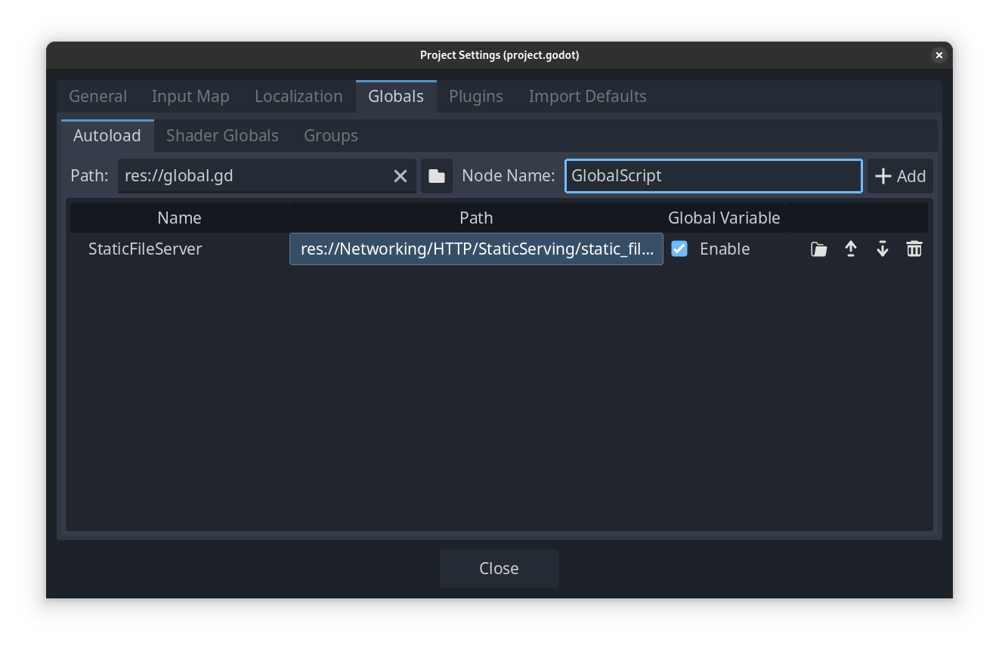

Pogosto se zgodi, da želimo iz neke skripte dostopati vrednosti, ki so izven nje. To ponavadi naredimo preko `@export var zunanja_stvar`, kar je dovolj dobro če to dostopamo enkrat ali dvakrat.  
Če se zgodi, da je skripta ki jo dostopamo zelo pomembna in jo potrebuje veliko komponent pa je bolj smiselno, če bi bila ta skripta `globalna` - Lahko bi jo dostopali povsod, brez `@export...`  
Ta preblem v Godot-ju rešujemo z **Singletoni**.  

## Kaj je Singleton

Kot pove ime, je to nek objekt, ki ima le eno instanco (single - sam). To instanco ob zagonu igre Godot avtomatsko naoži ter poskrbi, da jo lahko vedno uporabljamo v vseh naših skriptah.  

Pogosto se uproablja, da globalno izpostavimo [Signale](https://godot.lanvukusic.com/blog/signali/) ali ostale pomembne spremenljivke, ki jih pogosto dostopamo.  

## Autoload

Da lahko skripto uporabljamo, je potrebno nastaviti avtomatsko nalaganje.

Najprej pripravimo skripto, ki jo bomo uporabljali. V drevesu z resourci (ne sceni) ustvarimo novo skripto in jo poimenujemo (recimo global.gd).

```gdscript
extends Object

signal game_started(message: str)
var pomembna_vrednost: int = 2024
```

> Skripte ne pripnemo na nič!!  
> Godot bo skripto v igro pripel za nas.


Da to skripto označimo za avtomatsko nalaganje, gremo na:

- Project
- Project settings
- Globals (4 tab)
- Autoload
  - Pritisnemo ikono z mapo 🗀
  - Najdemo skripto global.gd (oz ime ki ste ga določili)
  - Pritisnemo "+ ADD"

Skripto lahko sedaj od kjerkoli dostopamo, po imenu ki je določeno v razdelku `Node Name`.  


## Primer

Če bi na skripti igralca potrebovali dostopati to skripto, bi to storili tako:

```gdscript
extends CharacterBody2D

# Called when the node enters the scene tree for the first time.
func _ready() -> void:
  # ko se igra zažene pozdravi vse
  GlobalScript.game_started.emit("Pozdravljeni sem igralec Janez")
  print("globalna pomembna vrednost je: ", GlobalScript.pomembna_vrednost)
  # srečno novo leto
  GlobalScript.pomembna_vrednost = 2025 # vrednosti lahko tudi spreminjamo
```
