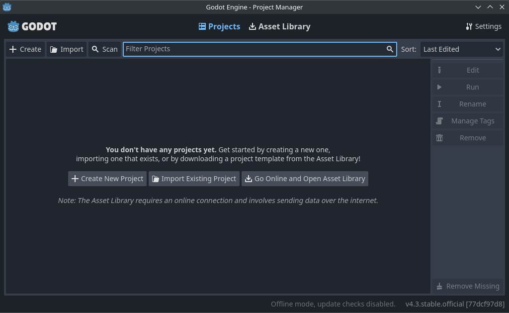
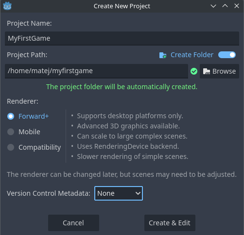
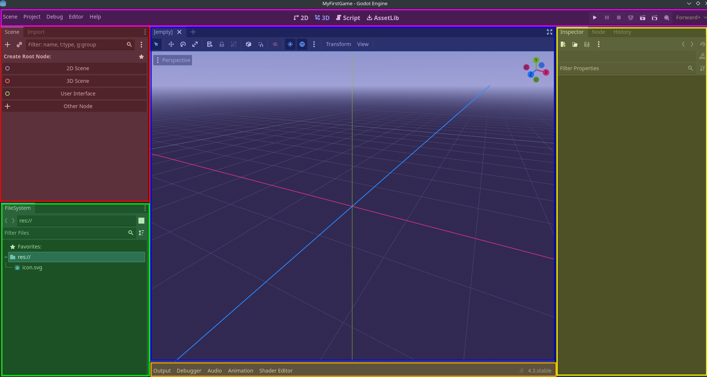
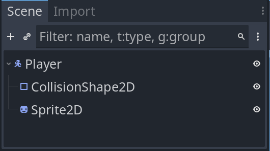

## Godot

`Godot` je odprtokodno razvojno okolje za izdelavo 2D in 3D videoiger.
Takšna orodja so v angleškem jeziku znana kot `game engine`.
Vsebujejo veliko orodji, ki nam olajšajo izdelavo videoiger.
Poleg Godota so znani še drugi game engine-i, kot so Unity, Unreal Engine in še mnogi drugi.
Godot je zelo priljubljen med *indie* razvijalci, saj je odprtokoden, kar pomeni, da je brezplačen in odprt za vse - lahko vidimo njegovo izvorno kodo in jo po želji prilagajamo svojim potrebam, kar pa zahteva že kar nekaj znanja.

## Namestitev

Naslov tega poglavja je malce zavajajoč, saj Godota ni potrebno namestiti.
Vse kar potrebujemo je, da na računalnik prenesemo Godot in ga zaženemo.

Iz spletne strani [https://godotengine.org](https://godotengine.org) prenesemo zip datoteko in jo razpakiramo. V času pisanja tega besedila je najnovejša verzija Godota 4.3. Na Windowsih dobimo dve datoteki, nas zanima `Godot_v4.3-stable_win64.exe`, sepravi brez `console`. Za lažji dostop si jo lahko premaknemo naprimer na namizje.

## Prva uporaba

Z dvojnim klikom zaženemo Godot. Odpre se nam sledeče okno:

Tukaj lahko vidimo vse projekte, na tem računalniku. Ker smo Godot pognali prvič je seznam prazen.
Kliknemo na `Create New Project` oz. `Create`. 
Izberemo ime projekta in mapo, kjer se bo projekt nahajal.
Ker je to prvi projekt, bomo za ime izbrali naprimer `MyFirstGame`.
Za lokacijo pa izberemo mapo, kjer bomo shranili projekt.
Lahko je to namizje, dokumenti ali kam drugam.
Polje renderer pustimo na privzeti vrednosti.
Version Control Metadata pa lahko nastavimo na `None` (z sistemom git se bomo mogoče srečali proti koncu krožka).

> Tukaj sem projekt usvaril na opracijskem sistemu Linux, zato izgleda malce drugače kot na Windowsih. Pri vas bo `Project Path` izgledal bolj podobno kot `C:\Users\Matej\Documents\MyFirstGame`.

Kliknemo `Create & Edit`. Odpre se nam glavno okno Godota, kjer lahko začnemo z razvojem igre.

## Spoznavanje Godot Editorja

Ko izberemo oz. ustvarimo projekt, se nam odpre Godot Editor.
Na prvi pogled lahko zgleda zelo kompleksen. 
Tekom krožka se bomo počasi spoznali z nekaterimi osnovnimi funkcijami. 
Vseh funkcij je čisto preveč in jih tudi sama z Lanom ne poznava.

Na sliki sem barvno označil nekaj osnovnih delov Godot Editorja.

### Osnovni toolbar (vijolična)

Na levi strani imamo osnovne funkcije, ki nam omogočajo vse od shranjevanja scene do urejanja različnih nastavitev.
Na sredini imamo gumbe za premikanje med glavnimi deli Godot Editorja - 2D, 3D ter urejevalnik skript.
Na desni strani pa imamo gumb za zagon igre.

### Scene tree (rdeča)

V tem delu vidimo vse elemente, ki so v trenutno odprti sceni. Tukaj bomo urejali in dodajali vse objekte, ki bodo prisotni v igri.

### Podatkovni sistem (zelena)

Tukaj bomo videli vse datoteke, ki jih bo naša igra potrebovala.
To so lahko slike, zvoki, skripte, itd.
Privzeto je v mapi samo Godot ikona `icon.svg`.

### Inspector (rumena)

V tem delu vidimo vse lastnosti izbranega objekta. Trenutno nimamo še nobenega objekta, zato je ta del prazen.

### Urejevalnik scen (modra)

To je glavni del Godot Editorja, kjer bomo urejali našo igro. Tukaj bomo dodajali objekte, jih premikali, spreminjali lastnosti, itd. Trenutno je nastavljen na 3D pogled, kar bomo zaenkrat spremenili na 2D. Kliknemo na `2D` v toolbarju nad tem oknom.

### Log (oranžna)

Tukaj bomo videli vse napake, opozorila in druge informacije, ki jih bo Godot izpisal. Trenutno je minimiziran. Če ga želimo odpreti, kliknemo na `Output`. Poleg vidimo še nekaj drugih zavihkov, ki so trenutno nepomembni.

# Ključni koncepti

Vsak *game engine* ima svoje ključne koncepte, ki jih moramo razumeti za uspešno uporabo.
Tukaj bomo predstavili dva osnovna koncepta: `node` in `scene`, prav kmalu pa jih bomo spoznali tudi v praksi.

Igra v Godotu je `drevo` `nodeov`, ki jih združujemo v `scene`. Vse to je vidno v `Scene tree` na levi strani Godot Editorja.

## Nodi

Nodi so osnovni gradniki igre, ki predstavljajo različne elemente igre, kot so igralec, svet, nasprotniki, zvok, kamera, slika in še veliko več.

Vsi nodi imajo sledeče lastnosti:
- ime noda
- lastnosti, ki jih lahko spreminjamo v `inspectorju`
- posodobljene so vsak `frame` igre
- nadgradimo jih lahko z novimi lastnostmi in funkcijami
- lahko jih dodamo drugim nodom kot `otroci`

Zadnja alineja je zelo pomembna in je ključna za razumevanje Godota.
S to lastnostjo lahko kombiniramo enostavne node v vedno bolj kompleksne strukture.

Na sliki vidimo enostavno kombinacijo nodov, ki predstavlja igralca. Vedno imamo en `root` node.
V tem primeru je to node z imenom `Player`.
Pod njim imamo dva otroka, `Sprite2D` in `CollisionShape2D`.
Node Sprite2D predstavlja opisuje videz igralca, CollisionShape2D pa igralcu onemogoča sprehajanje skozi okolje (npr. stene in tla).

## Scene
V Godotu igre razbijemo na scene, ki jih lahko `uporabimo večkrat`.
Primer večkratne uporabe so lahko nasprotniki.
Vso logiko in izgled napišemo samo enkrat, nato pa jih lahko poljubno število dodamo v katerokoli sceno.
Če želimo spremeniti izgled nasprotnika, to storimo samo enkrat v osnovni sceni nasprotnika, ta sprememba pa bo vidna v vseh scenah, kjer je ta nasprotnik prisoten.

V zgornjem primeru na sliki bi lahko vse 3 node "zapakirali" v eno sceno, ki bi predstavljala igralca. To "sceno igralca" bi lahko nato dodali kamorkoli, kjer želimo, da se igralec pojavi.

## Zaključek

S tem smo končali z uvodom v Godot. Verjetno vam stvari izgledajo zelo kompleksne, vendar se bomo skozi krožek postopoma spoznali z ogrodjem Godot.
Vseeno pa se od vas pričakuje vsaj malo motivacije za učenje novih stvari.
*GameDev* ni enostaven in potrebuje veliko truda in vztrajnosti.
Ne bojte si eksperimentirati in poizkušati novih stvari, tudi če sprva nič ne bo delovalo.
Ko se kaj zatakne lahko vprašate naju z Lanom, odprete Google in poiščete rešitev, ali pa se obrnete na uradno [dokumentacijo](https://docs.godotengine.org/en/stable/) Godota, še posebej poglavje [Getting Started](https://docs.godotengine.org/en/stable/getting_started/introduction/index.html), po katerem so napisana tudi začetna poglavja tega krožka.
S samo strmenjem v ekran se ne bo nič naredilo samo od sebe.
Če želite od krožka odnesti kar se da veliko, je priporočljivo, da se tudi doma malce sami poigrate z Godotom.

